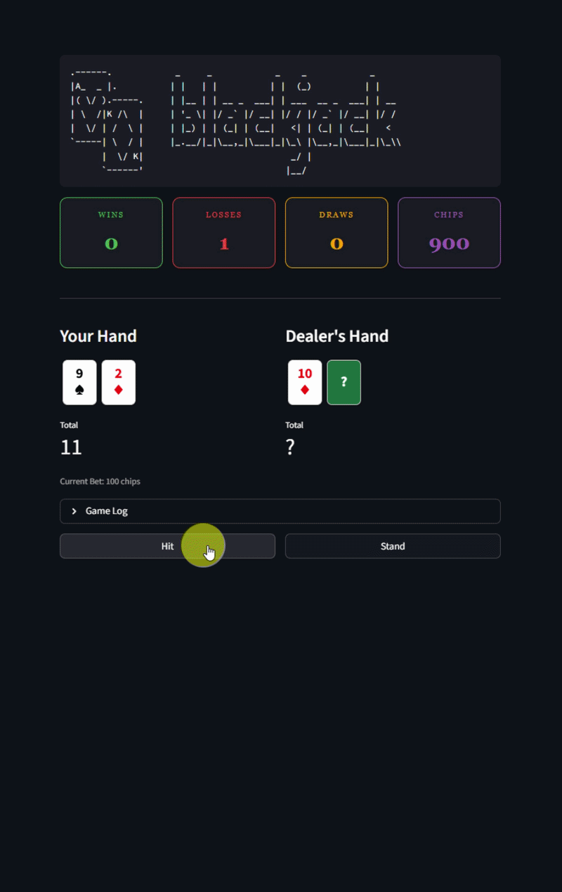
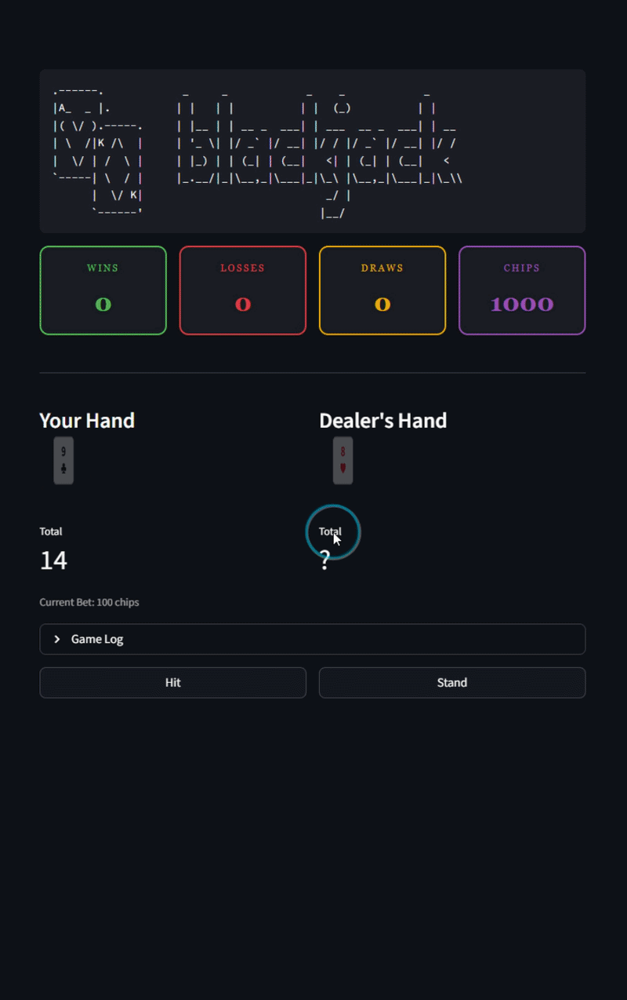
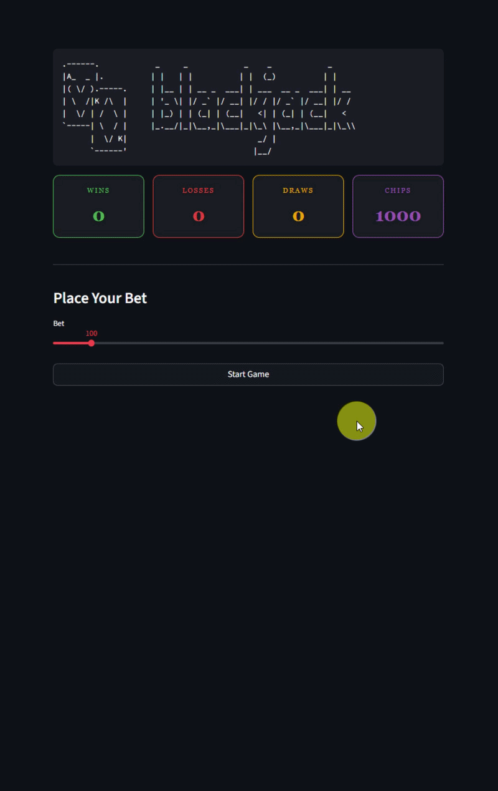

# 🃏 Blackjack — Tarayıcı Tabanlı Kart Oyunu

Streamlit ile geliştirilmiş, tarayıcıda çalışan interaktif bir **Blackjack (21)** oyunu.


<div align="center">
  
  <br>
  <em>🎉 Kazanma anı — havai fişekler ve balonlarla kutlama!</em>
</div>

---

## ✨ Özellikler

| Özellik | Açıklama |
|---|---|
| 🎰 **Bahis Sistemi** | Her el öncesi 10–mevcut chip arasında bahis koyma |
| 🂠 **Gizli Kartlar** | Dealer'ın kartları oyun bitene kadar gizli kalır |
| 🎆 **Havai Fişek & Balonlar** | Kazandığınızda kutlama animasyonları |
| 📊 **Skor Paneli** | Kazanma, kaybetme, beraberlik ve chip takibi |
| 📜 **Oyun Logu** | Her elin detaylı kart geçmişi |
| 🎨 **Kart Animasyonları** | CSS ile akıcı kart dağıtım efektleri |

<div align="center">
  
  <br>
  <em>📜 Oyun logu — her elin detaylı kart geçmişi</em>
</div>

---

## 📁 Proje Yapısı

```
Blackjack Project/
├── main.py        # Streamlit arayüzü ve sayfa akışı
├── game.py        # Oyun mantığı (hit, stand, deal, end_game)
├── ui.py          # Render fonksiyonları, CSS ve JS animasyonları
├── config.py      # Sabitler (LIMIT, DEALER_STAND, CARD_VALUES...)
├── art.py         # ASCII logo
├── assets/        # GIF ve görseller
├── requirements.txt # Bağımlılıklar
└── README.md      # Bu dosya
```

---

## 🚀 Kurulum ve Çalıştırma

### 1. Depoyu klonlayın

```bash
git clone https://github.com/kaplanonurr/blackjack-python.git
cd blackjack-python
```

### 2. Sanal ortam oluşturun

```bash
python -m venv .venv
```

**Aktivasyon:**

| İşletim Sistemi | Komut |
|---|---|
| 🪟 Windows | `.venv\Scripts\activate` |
| 🐧 Linux / 🍎 macOS | `source .venv/bin/activate` |

### 3. Bağımlılıkları yükleyin

```bash
pip install -r requirements.txt
```

### 4. Oyunu başlatın

```bash
streamlit run main.py
```

Tarayıcınızda otomatik olarak `http://localhost:8501` adresinde açılacaktır. 🎉

---

## 🎮 Nasıl Oynanır?

1. **Bahis koy** — Slider ile bahis miktarını seç ve "Start Game" butonuna bas
2. **Hit** — Yeni bir kart çek (21'i geçmemeye dikkat!)
3. **Stand** — Elindeki kartlarla kal, sıra Dealer'a geçsin
4. **Sonuç** — 21'e en yakın olan kazanır; 21'i geçen kaybeder

<div align="center">
  
  <br>
  <em>💥 Bust! 21'i geçersen anında kaybedersin</em>
</div>

### 📌 Kurallar

- 🂡 **As (A):** 11 veya 1 değerinde sayılır (otomatik ayarlanır)
- 👑 **J, Q, K:** 10 değerindedir
- 🏦 **Dealer:** 17 ve üzeri toplama ulaşınca durur
- 💰 **Başlangıç:** 1000 chip ile oyuna başlarsınız
- 💥 **Bust:** 21'i geçerseniz anında kaybedersiniz

---

## 🛠️ Teknolojiler

- **Python 3.10+**
- **Streamlit** — Web arayüzü
- **HTML / CSS / JavaScript** — Kart tasarımı ve animasyonlar

